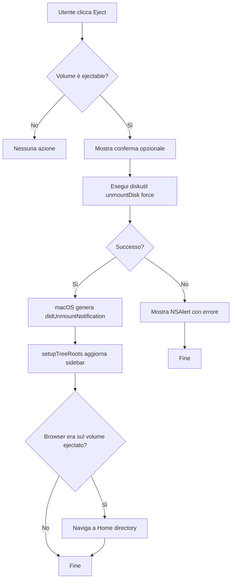

# Specifica Architetturale: Funzione Eject Volumi Rimovibili

## Panoramica

Implementazione della funzione di espulsione (eject) per volumi rimovibili in BetterFinder, con integrazione nella sidebar (context menu) e nella toolbar (pulsante dedicato).

---

## 1. Dove posizionare l'azione di eject

### 1.1 Sidebar - Context Menu
- **Posizione**: Nel context menu esistente di [`TreeRow`](BetterFinder/Views/Sidebar/SidebarView.swift:197)
- **Visibilità**: L'opzione "Eject" appare SOLO quando il nodo è di tipo `.volume` (disco esterno/rimovibile)
- **Posizionamento nel menu**: Dopo "Open in Terminal", prima del Divider finale

### 1.2 Toolbar - Pulsante dedicato
- **Posizione**: Nel [`BrowserToolbar`](BetterFinder/Views/Toolbar/ToolbarView.swift:4) all'interno di `ToolbarItemGroup(placement: .primaryAction)`
- **Visibilità**: Il pulsante appare SOLO quando la directory corrente è un volume rimovibile (`.volume`) o si trova al suo interno
- **Stato disabled**: Quando il volume selezionato non è un dispositivo rimovibile

---

## 2. Implementazione della logica di eject

### 2.1 Approccio tecnico: `Process` con `diskutil`

Verrà utilizzato `diskutil unmountDisk force` tramite `Process` come approccio principale, poiché:
- Non richiede entitlements speciali
- È compatibile con le sandbox macOS
- Fornisce output di errore chiaro per il debugging

**Alternativa scartata**: Disk Arbitration Framework richiederebbe entitlements aggiuntivi e non è compatibile con l'architettura sandboxed dell'app.

### 2.2 Nuovo servizio: `VolumeService`

Creazione di un nuovo file `BetterFinder/Services/VolumeService.swift` che gestisce:
- Rilevamento se un URL appartiene a un volume rimovibile
- Esecuzione dell'eject con gestione errori
- Notifica del risultato all'UI

```swift
// Struttura del servizio
@MainActor
final class VolumeService: Observable {
    /// Verifica se un URL è un volume rimovibile ejectabile
    func isEjectableVolume(_ url: URL) -> Bool
    
    /// Restituisce il volume mount point per un dato URL
    func volumeMountPoint(for url: URL) -> URL?
    
    /// Esegue l'eject del volume contenente l'URL
    func ejectVolume(at url: URL) async throws
}
```

### 2.3 Logica di eject

```
1. Identificare il mount point del volume
2. Verificare che il volume sia locale (non di rete)
3. Eseguire: diskutil unmountDisk force <mountPoint>
4. Gestire l'output:
   - Successo: il sistema genera didUnmountNotification automaticamente
   - Errore: mostrare NSAlert con il messaggio di errore
```

---

## 3. Icona per l'eject

### 3.1 SF Symbol per il pulsante toolbar
- **Simbolo**: `eject.circle.fill`
- **Rendering mode**: `.hierarchical`
- **Dimensione**: coerente con gli altri pulsanti toolbar

### 3.2 Icona nel context menu
- Nessun'icona aggiuntiva nel context menu (coerente con lo stile esistente)
- Il testo del menu item sarà: "Eject "[Volume Name]""

### 3.3 Icona nell'asset catalog
- **Non necessaria**: si utilizza SF Symbol, nessuna nuova icona da aggiungere all'asset catalog

---

## 4. File da modificare

### 4.1 Nuovo file: `BetterFinder/Services/VolumeService.swift`
**Scopo**: Servizio centralizzato per operazioni sui volumi
**Contenuto**:
- `isEjectableVolume(_:)` - verifica se un URL è un volume ejectable
- `volumeMountPoint(for:)` - trova il mount point del volume
- `ejectVolume(at:)` - esegue l'eject tramite `diskutil`
- Gestione errori con tipi custom

### 4.2 Modifica: `BetterFinder/State/AppState.swift`
**Modifiche**:
- Aggiungere proprietà `let volumeService = VolumeService()`
- Aggiungere metodo `func ejectVolume(for url: URL)` che delega al servizio
- Aggiungere proprietà di stato per il feedback UI (es. `isEjectingVolume`)

### 4.3 Modifica: `BetterFinder/Views/Sidebar/SidebarView.swift`
**Modifiche**:
- Nel `.contextMenu` di [`TreeRow`](BetterFinder/Views/Sidebar/SidebarView.swift:323), aggiungere condizionalmente il button "Eject" quando `node.kind == .volume`
- Il button chiama `appState.ejectVolume(for: node.url)`
- Mostrare solo se `appState.volumeService.isEjectableVolume(node.url)`

### 4.4 Modifica: `BetterFinder/Views/Toolbar/ToolbarView.swift`
**Modifiche**:
- Aggiungere nuovo `Button` nel `ToolbarItemGroup(placement: .primaryAction)`
- Il button è visibile solo quando il volume corrente è ejectable
- Binding a `appState.volumeService.isEjectableVolume(appState.activeBrowser.currentURL)`
- Icona: `eject.circle.fill`

### 4.5 Modifica: `BetterFinder/State/BrowserState.swift`
**Modifiche**:
- Aggiungere proprietà computed `currentVolumeURL: URL?` che restituisce il mount point del volume corrente (se applicabile)

---

## 5. Aggiornamento dell'interfaccia dopo l'eject

### 5.1 Meccanismo esistente
Il progetto già ascolta le notifiche di mount/unmount:
```swift
// In AppState.swift:394-397
NotificationCenter.default.addObserver(
    forName: NSWorkspace.didUnmountNotification,
    object: nil, queue: .main
) { [weak self] _ in self?.setupTreeRoots() }
```

### 5.2 Comportamento dopo eject
1. L'eject viene eseguito tramite `diskutil`
2. macOS genera automaticamente `NSWorkspace.didUnmountNotification`
3. `setupTreeRoots()` viene chiamato automaticamente
4. La sidebar si aggiorna rimuovendo il volume espulso
5. Se il browser stava visualizzando il volume espulso:
   - Navigare automaticamente alla Home directory
   - Mostrare un breve feedback all'utente (opzionale)

### 5.3 Gestione errore durante l'eject
- Mostrare `NSAlert` con messaggio di errore descrittivo
- Non modificare lo stato dell'UI
- Permettere all'utente di riprovare

---

## 6. Diagramma di flusso



---

## 7. Considerazioni su errori e casi limite

### 7.1 Volume in uso
- **Errore**: `diskutil` restituisce "Resource busy"
- **Gestione**: Mostrare alert "Impossibile espellere. Il volume è attualmente in uso."
- **Suggerimento**: Offrire all'utente di forzare l'eject con `diskutil unmountDisk force`

### 7.2 Volume di sistema
- **Protezione**: `isEjectableVolume` esclude il volume root `/` e i volumi di sistema
- **Verifica**: Controllare che il volume sia locale ma NON sia il boot volume

### 7.3 Volume di rete
- **Esclusione**: I volumi di rete (`.network`) non devono mostrare l'opzione eject
- **Motivo**: L'eject di volumi di rete richiede un approccio diverso (`umount` o `diskutil unmount`)

### 7.4 Eject multiplo
- **Scenario**: Utente clicca eject rapidamente più volte
- **Protezione**: Stato `isEjectingVolume` previene esecuzioni concorrenti

### 7.5 Volume già espulso
- **Scenario**: Notifica di unmount arriva prima del completamento del comando
- **Gestione**: Verificare che il volume esista ancora prima di mostrare errori

---

## 8. Integrazione con l'UI esistente

### 8.1 Context Menu Sidebar
```swift
// Da aggiungere nel contextMenu di TreeRow dopo "Open in Terminal"
if node.kind == .volume && appState.volumeService.isEjectableVolume(node.url) {
    Divider()
    Button("Eject \"\(node.name)\"") {
        appState.ejectVolume(for: node.url)
    }
}
```

### 8.2 Toolbar Button
```swift
// Da aggiungere in BrowserToolbar nel primaryAction group
if let volumeURL = appState.activeBrowser.currentVolumeURL,
   appState.volumeService.isEjectableVolume(volumeURL) {
    Button {
        appState.ejectVolume(for: volumeURL)
    } label: {
        Image(systemName: "eject.circle.fill")
            .symbolRenderingMode(.hierarchical)
    }
    .help("Eject Volume")
}
```

### 8.3 Coerenza visiva
- Stesso stile dei pulsanti toolbar esistenti
- Stesso formato del context menu esistente
- Nessun cambiamento al design system

---

## 9. Riepilogo modifiche

| File | Tipo | Descrizione |
|------|------|-------------|
| `Services/VolumeService.swift` | NUOVO | Servizio per operazioni sui volumi |
| `State/AppState.swift` | MODIFICA | Aggiungere volumeService e metodo ejectVolume |
| `State/BrowserState.swift` | MODIFICA | Aggiungere proprietà currentVolumeURL |
| `Views/Sidebar/SidebarView.swift` | MODIFICA | Aggiungere voce context menu Eject |
| `Views/Toolbar/ToolbarView.swift` | MODIFICA | Aggiungere pulsante Eject in toolbar |

---

## 10. Test consigliati

1. **Eject successo**: Espellere un volume USB e verificare che la sidebar si aggiorni
2. **Volume in uso**: Tentare eject con file aperto e verificare messaggio errore
3. **Volume di sistema**: Verificare che "/" non mostri opzione eject
4. **Volume di rete**: Verificare che volumi network non mostrino opzione eject
5. **Navigazione post-eject**: Verificare che il browser navighi a Home dopo eject
6. **Eject multiplo**: Verificare che click multipli non causino race condition